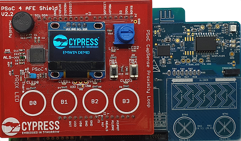
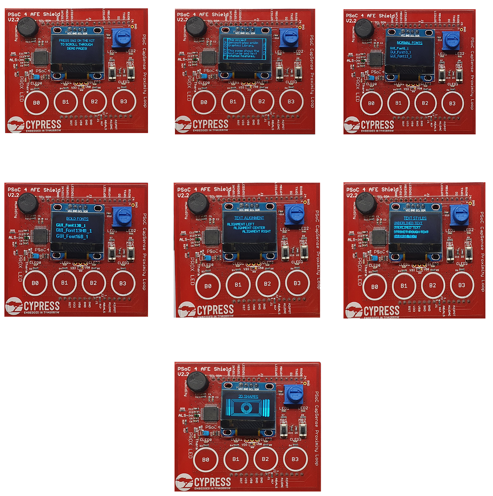

# PSoC6 MCU: emWin OLED with Mbed OS

This code example demonstrates how to display graphics on an OLED display using emWin graphics library in Mbed OS. The example uses the CY8CKIT-032 AFE Shield. This shield has a monochrome OLED display with the SSD1306 controller with a resolution of 128x64 pixels.

Tested with Mbed OS v6.2.1.

[Provide feedback on this code example.](https://cypress.co1.qualtrics.com/jfe/form/SV_1NTns53sK2yiljn?Q_EED=eyJVbmlxdWUgRG9jIElkIjoiQ0UyMzE5OTMiLCJTcGVjIE51bWJlciI6IjAwMi0zMTk5MyIsIkRvYyBUaXRsZSI6IlBTb0M2IE1DVTogZW1XaW4gT0xFRCB3aXRoIE1iZWQgT1MiLCJyaWQiOiJtdWFhIiwiRG9jIHZlcnNpb24iOiIyLjAuMCIsIkRvYyBMYW5ndWFnZSI6IkVuZ2xpc2giLCJEb2MgRGl2aXNpb24iOiJNQ0QiLCJEb2MgQlUiOiJJQ1ciLCJEb2MgRmFtaWx5IjoiUFNPQyJ9)

## Requirements

- Programming Language: C/C++

- Associated Parts: All [PSoC® 6 MCU](http://www.cypress.com/PSoC6) parts

- [Mbed CLI](https://github.com/ARMmbed/mbed-cli)

- [ModusToolbox® v2.1](https://www.cypress.com/documentation/software-and-drivers/modustoolbox-software-archives)

  **Note:** You do not need to install ModusToolbox to build and run this code example. However, installing it is required when you need to:

  - Debug using the Eclipse IDE for ModusToolbox. See the [user guide](https://www.cypress.com/MTBEclipseIDEUserGuide) for details.

  - Customize the default device configuration using any of the Configurator tools

  - Port this code example to a new target that is not listed under the [Supported Kits](#supported-kits-mbed-cli-argument--m)

## Supported Toolchains (Mbed CLI argument `-t`)

- [GNU Arm® Embedded Compiler v9.2.1](https://developer.arm.com/open-source/gnu-toolchain/gnu-rm/downloads) (`GCC_ARM`)
- [Arm Compiler v6.14](https://developer.arm.com/tools-and-software/embedded/arm-compiler/downloads/version-6) (`ARM`)

## Supported Kits (Mbed CLI argument `-m`)

- [PSoC 6 BLE Pioneer Kit](https://www.cypress.com/CY8CKIT-062-BLE) (`CY8CKIT-062-BLE`)
- [PSoC 6 WiFi-BT Pioneer Kit](https://www.cypress.com/CY8CKIT-062-WiFi-BT) (`CY8CKIT-062-WIFI-BT`)
- [PSoC 62S2 Wi-Fi BT Pioneer Kit](https://www.cypress.com/CY8CKIT-062S2-43012) (`CY8CKIT-062S2-43012`)
- [PSoC 62S1 Wi-Fi BT Pioneer Kit](https://www.cypress.com/CYW9P62S1-43438EVB-01) (`CYW9P62S1-43438EVB-01`)
- [PSoC 62S1 Wi-Fi BT Pioneer Kit](https://www.cypress.com/CYW9P62S1-43012EVB-01) (`CYW9P62S1-43012EVB-01`)
- [PSoC 64 Secure Boot Wi-Fi BT Pioneer Kit](http://www.cypress.com/CY8CKIT-064B0S2-4343W) (`CY8CKIT-064B0S2-4343W`)

## Hardware Setup

This code example requires [CY8CKIT-032 PSoC Analog Front End (AFE) Arduino Shield](https://www.cypress.com/documentation/development-kitsboards/cy8ckit-032-psoc-analog-front-end-afe-arduino-shield).

**Note:** The PSoC 6 BLE Pioneer Kit (CY8CKIT-062-BLE) and the PSoC 6 WiFi-BT Pioneer Kit (CY8CKIT-062-WIFI-BT) ship with KitProg2 installed. The ModusToolbox software requires KitProg3. Before using this code example, make sure that the board is upgraded to KitProg3. The tool and instructions are available in the [Firmware Loader](https://github.com/cypresssemiconductorco/Firmware-loader) GitHub repository. If you do not upgrade, you will see an error like "unable to find CMSIS-DAP device" or "KitProg firmware is out of date".

For Mbed OS, the kit must be in DAPLink mode. See the **KitProg3 User Guide** (see *Documentation* tab in the [Cypress Programming Solutions](https://www.cypress.com/products/psoc-programming-solutions) web page) to learn how to put the Pioneer Kit into DAPLink mode.

## Software Setup

Install a terminal emulator if you don't have one. Instructions in this document use [Tera Term](https://ttssh2.osdn.jp/index.html.en).

This example requires no additional software or tools.

## Import the Code Example Using Mbed CLI

Mbed CLI commands are used to import the code example and compile. See [Working with Mbed CLI web page](https://os.mbed.com/docs/mbed-os/v6.2/tools/working-with-mbed-cli.html).

```
mbed import https://github.com/cypresssemiconductorco/mbed-os-example-emwin-oled
```

This command first clones the code example repository from GitHub, and then deploys all the libraries.

If you wish to perform the *deploy* process manually, use the following commands:

1. Clone the GitHub code example repository:

   ```
   git clone https://github.com/cypresssemiconductorco/mbed-os-example-emwin-oled && cd mbed-os-example-emwin-oled
   ```

2. Deploy the dependent libraries. The library files are identified with the *.lib* extension.

   ```
   mbed deploy
   ```

3. Set the current directory as *root*:

   ```
   mbed new .
   ```

## Operation

If using a PSoC 64 Secure MCU kit (like CY8CKIT-064B0S2-4343W), the PSoC 64 Secure MCU must be provisioned with keys and policies before being programmed. Follow the instructions in the [Secure Boot SDK User Guide](https://www.cypress.com/documentation/software-and-drivers/psoc-64-secure-mcu-secure-boot-sdk-user-guide) to provision the device. If the kit is already provisioned, copy-paste the keys and policy folder to the application folder.

1. Connect the board to your PC using the provided USB cable through the KitProg3 USB connector.

2. Program the board using the Mbed command to compile and flash the application using hte default toolchain to the default target:

      ```
      mbed compile -m <TARGET> -t <TOOLCHAIN> --flash --sterm
      ```

      For example, to build for the target `CY8CKIT-062-BLE` with the toolchain `GCC_ARM`, use the following command:

      ```
      mbed compile -m CY8CKIT_062_BLE -t GCC_ARM --flash --sterm
      ```

   **Note:** With the `--sterm` option, Mbed CLI opens a new terminal with 9600-8N1 as the setting after programming completes. Do not use this option if you want to connect using another serial terminal application such as PuTTY or Tera Term.

3. After programming, the application starts automatically. Confirm that the the startup screen with Cypress logo is displayed on the OLED display for 3 seconds. After 3 seconds, another screen with instructions to press the user switch to scroll through the display pages is displayed.

4. Press the user switch to scroll through various display pages that demonstrate the emWin graphic library's 2D graphics features:
  - Text wrap and rotation
  - Font sizes - normal fonts
  - Font sizes - bold fonts
  - Text alignments and styles
  - 2D Graphics with vertical lines of various thickness, rectangles and circles

    **Figure 1. Startup Screen**

   

   **Figure 2. 2D Graphics**

   

## Debugging

You can debug the example to step through the code. In the IDE, use the **\<Application Name> Debug (KitProg3_MiniProg4)** configuration in the **Quick Panel**. For more details, see the "Program and Debug" section in the [Eclipse IDE for ModusToolbox User Guide](https://www.cypress.com/MTBEclipseIDEUserGuide).

Follow the steps from [Eclipse IDE for ModusToolbox User Guide](https://www.cypress.com/MTBEclipseIDEUserGuide#page=23) to export the Mbed OS code example and import it into Eclipse IDE for ModusToolbox for programming and debugging.

Mbed OS also supports debugging using any IDE that supports GDB. See [Arm Mbed documentation](https://os.mbed.com/docs/mbed-os/v6.2/debug-test/index.html) to learn about debugging steps.

**Note:** **(Only while debugging)** On the CM4 CPU, some code in `main()` may execute before the debugger halts at the beginning of `main()`. This means that some code executes twice - once before the debugger stops execution, and again after the debugger resets the program counter to the beginning of `main()`. See [KBA231071](https://community.cypress.com/docs/DOC-21143) to learn about this and for the workaround.


## Design and Implementation

This code example requires the [CY8CKIT-032 PSoC Analog Front End (AFE) Arduino Shield](https://www.cypress.com/documentation/development-kitsboards/cy8ckit-032-psoc-analog-front-end-afe-arduino-shield). It has a 128x64 graphics OLED display which can communicate through the I2C interface.

There are three important parts in this code example:

1. **emWin Graphics Library:** The emWin Graphics Library is implemented as a middleware and has all the graphics functions. In this example, the library manages a display buffer and updates it with the pixel data in accordance with the graphics operations performed.

   See the [emWin middleware documentation](https://github.com/cypresssemiconductorco/emwin) on GitHub learn about the structure of the emWin package, supported drivers, and for a quick start guide to create and run your first emWin project from scratch. The documentation page also contains configuration details on a wide variety of display drivers provided my emWin.

2. **OLED Display Driver:** The OLED display has a SSD1306 controller. The display-oled-ssd1306 library is used to drive the display. This library provides functions to support the dot matrix OLED display driven by the SSD1306 controller through the I2C interface.

3. **Application Code:** The application code calls emWin graphics APIs to perform graphic functions.

### Resources and Settings

**Table 1. Application Resources**

| Resource  |  Alias/Object     |    Purpose     |
| :------- | :------------    | :------------ |
|  I2C(HAL) |      Display_I2C      |  Interface to communicate with OLED shield |
|  GPIO(HAL)| USER_BUTTON    |  User Switch |

## Related Resources

| Application Notes                                            |                                                              |
| :----------------------------------------------------------- | :----------------------------------------------------------- |
| [AN228571](https://www.cypress.com/AN228571) – Getting Started with PSoC 6 MCU on ModusToolbox | Describes PSoC 6 MCU devices and how to build your first application with ModusToolbox |
| [AN221774](https://www.cypress.com/AN221774) – Getting Started with PSoC 6 MCU on PSoC Creator | Describes PSoC 6 MCU devices and how to build your first application with PSoC Creator |
| [AN210781](https://www.cypress.com/AN210781) – Getting Started with PSoC 6 MCU with Bluetooth Low Energy (BLE) Connectivity on PSoC Creator | Describes PSoC 6 MCU with BLE Connectivity devices and how to build your first application with PSoC Creator |
| [AN215656](https://www.cypress.com/AN215656) – PSoC 6 MCU: Dual-CPU System Design | Describes the dual-CPU architecture in PSoC 6 MCU, and shows how to build a simple dual-CPU design |
| **Code Examples**                                            |                                                              |
| [Using ModusToolbox](https://github.com/cypresssemiconductorco/Code-Examples-for-ModusToolbox-Software) | [Using PSoC Creator](https://www.cypress.com/documentation/code-examples/psoc-6-mcu-code-examples) |
| **Device Documentation**                                     |                                                              |
| [PSoC 6 MCU Datasheets](https://www.cypress.com/search/all?f[0]=meta_type%3Atechnical_documents&f[1]=resource_meta_type%3A575&f[2]=field_related_products%3A114026) | [PSoC 6 Technical Reference Manuals](https://www.cypress.com/search/all/PSoC%206%20Technical%20Reference%20Manual?f[0]=meta_type%3Atechnical_documents&f[1]=resource_meta_type%3A583) |
| **Development Kits**                                         | Buy at www.cypress.com                                       |
| [CY8CKIT-062-BLE](https://www.cypress.com/CY8CKIT-062-BLE) PSoC 6 BLE Pioneer Kit | [CY8CKIT-062-WiFi-BT](https://www.cypress.com/CY8CKIT-062-WiFi-BT) PSoC 6 WiFi-BT Pioneer Kit |
| [CY8CPROTO-063-BLE](https://www.cypress.com/CY8CPROTO-063-BLE) PSoC 6 BLE Prototyping Kit | [CY8CPROTO-062-4343W](https://www.cypress.com/CY8CPROTO-062-4343W) PSoC 6 Wi-Fi BT Prototyping Kit |
| [CY8CKIT-062S2-43012](https://www.cypress.com/CY8CKIT-062S2-43012) PSoC 62S2 Wi-Fi BT Pioneer Kit | [CY8CPROTO-062S3-4343W](https://www.cypress.com/CY8CPROTO-062S3-4343W) PSoC 62S3 Wi-Fi BT Prototyping Kit |
| [CYW9P62S1-43438EVB-01](https://www.cypress.com/CYW9P62S1-43438EVB-01) PSoC 62S1 Wi-Fi BT Pioneer Kit | [CYW9P62S1-43012EVB-01](https://www.cypress.com/CYW9P62S1-43012EVB-01) PSoC 62S1 Wi-Fi BT Pioneer Kit |
| [CY8CKIT-064B0S2-4343W](http://www.cypress.com/CY8CKIT-064B0S2-4343W) PSoC 64 Secure Boot Wi-Fi BT Pioneer Kit |
| **Libraries**                                                |                                                              |
| PSoC 6 Peripheral Driver Library (PDL) and docs  | [mtb-pdl-cat1](https://github.com/cypresssemiconductorco/mtb-pdl-cat1) on GitHub |
| Cypress Hardware Abstraction Layer (HAL) Library and docs    | [mtb-hal-cat1](https://github.com/cypresssemiconductorco/mtb-hal-cat1) on GitHub |
| Retarget IO - A utility library to retarget the standard input/output (STDIO) messages to a UART port | [retarget-io](https://github.com/cypresssemiconductorco/retarget-io) on GitHub |
| **Middleware**                                               |                                                              |
| CapSense® library and docs                                   | [capsense](https://github.com/cypresssemiconductorco/capsense) on GitHub |
| SEGGER emWin Middleware Library                              | [emwin](https://github.com/cypresssemiconductorco/emwin) on GitHub |
| Links to all PSoC 6 MCU Middleware                           | [psoc6-middleware](https://github.com/cypresssemiconductorco/psoc6-middleware) on GitHub |
| **Tools**                                                    |                                                              |
| [Eclipse IDE for ModusToolbox](https://www.cypress.com/modustoolbox) | The cross-platform, Eclipse-based IDE for IoT designers that supports application configuration and development targeting converged MCU and wireless systems. |
| [PSoC Creator™](https://www.cypress.com/products/psoc-creator-integrated-design-environment-ide) | The Cypress IDE for PSoC and FM0+ MCU development. |

## Other Resources

Cypress provides a wealth of data at www.cypress.com to help you select the right device, and quickly and effectively integrate it into your design.

For PSoC 6 MCU devices, see [How to Design with PSoC 6 MCU - KBA223067](https://community.cypress.com/docs/DOC-14644) in the Cypress community.

## Document History

Document Title: *CE231993* - *PSoC6 MCU emWin OLED with Mbed OS*

| Version | Description of Change |
| ------- | --------------------- |
| 1.0.0   | New code example. Tested with Mbed OS Version 5.12.2. |
| 1.1.0   | Updated to Mbed OS 5.13.3. |
| 2.0.0   | Updated to Mbed OS 6.2.1. <br /> Minor code changes - Updated to use sleep_for instead of wait_ms.  |

------


All other trademarks or registered trademarks referenced herein are the property of their respective owners.


-------------------------------------------------------------------------------

© Cypress Semiconductor Corporation, 2020. This document is the property of Cypress Semiconductor Corporation and its subsidiaries ("Cypress"). This document, including any software or firmware included or referenced in this document ("Software"), is owned by Cypress under the intellectual property laws and treaties of the United States and other countries worldwide. Cypress reserves all rights under such laws and treaties and does not, except as specifically stated in this paragraph, grant any license under its patents, copyrights, trademarks, or other intellectual property rights. If the Software is not accompanied by a license agreement and you do not otherwise have a written agreement with Cypress governing the use of the Software, then Cypress hereby grants you a personal, non-exclusive, nontransferable license (without the right to sublicense) (1) under its copyright rights in the Software (a) for Software provided in source code form, to modify and reproduce the Software solely for use with Cypress hardware products, only internally within your organization, and (b) to distribute the Software in binary code form externally to end users (either directly or indirectly through resellers and distributors), solely for use on Cypress hardware product units, and (2) under those claims of Cypress's patents that are infringed by the Software (as provided by Cypress, unmodified) to make, use, distribute, and import the Software solely for use with Cypress hardware products. Any other use, reproduction, modification, translation, or compilation of the Software is prohibited.<br />
TO THE EXTENT PERMITTED BY APPLICABLE LAW, CYPRESS MAKES NO WARRANTY OF ANY KIND, EXPRESS OR IMPLIED, WITH REGARD TO THIS DOCUMENT OR ANY SOFTWARE OR ACCOMPANYING HARDWARE, INCLUDING, BUT NOT LIMITED TO, THE IMPLIED WARRANTIES OF MERCHANTABILITY AND FITNESS FOR A PARTICULAR PURPOSE. No computing device can be absolutely secure. Therefore, despite security measures implemented in Cypress hardware or software products, Cypress shall have no liability arising out of any security breach, such as unauthorized access to or use of a Cypress product. CYPRESS DOES NOT REPRESENT, WARRANT, OR GUARANTEE THAT CYPRESS PRODUCTS, OR SYSTEMS CREATED USING CYPRESS PRODUCTS, WILL BE FREE FROM CORRUPTION, ATTACK, VIRUSES, INTERFERENCE, HACKING, DATA LOSS OR THEFT, OR OTHER SECURITY INTRUSION (collectively, "Security Breach"). Cypress disclaims any liability relating to any Security Breach, and you shall and hereby do release Cypress from any claim, damage, or other liability arising from any Security Breach. In addition, the products described in these materials may contain design defects or errors known as errata which may cause the product to deviate from published specifications. To the extent permitted by applicable law, Cypress reserves the right to make changes to this document without further notice. Cypress does not assume any liability arising out of the application or use of any product or circuit described in this document. Any information provided in this document, including any sample design information or programming code, is provided only for reference purposes. It is the responsibility of the user of this document to properly design, program, and test the functionality and safety of any application made of this information and any resulting product. "High-Risk Device" means any device or system whose failure could cause personal injury, death, or property damage. Examples of High-Risk Devices are weapons, nuclear installations, surgical implants, and other medical devices. "Critical Component" means any component of a High-Risk Device whose failure to perform can be reasonably expected to cause, directly or indirectly, the failure of the High-Risk Device, or to affect its safety or effectiveness. Cypress is not liable, in whole or in part, and you shall and hereby do release Cypress from any claim, damage, or other liability arising from any use of a Cypress product as a Critical Component in a High-Risk Device. You shall indemnify and hold Cypress, its directors, officers, employees, agents, affiliates, distributors, and assigns harmless from and against all claims, costs, damages, and expenses, arising out of any claim, including claims for product liability, personal injury or death, or property damage arising from any use of a Cypress product as a Critical Component in a High-Risk Device. Cypress products are not intended or authorized for use as a Critical Component in any High-Risk Device except to the limited extent that (i) Cypress's published data sheet for the product explicitly states Cypress has qualified the product for use in a specific High-Risk Device, or (ii) Cypress has given you advance written authorization to use the product as a Critical Component in the specific High-Risk Device and you have signed a separate indemnification agreement.<br />
Cypress, the Cypress logo, Spansion, the Spansion logo, and combinations thereof, WICED, PSoC, CapSense, EZ-USB, F-RAM, and Traveo are trademarks or registered trademarks of Cypress in the United States and other countries. For a more complete list of Cypress trademarks, visit cypress.com. Other names and brands may be claimed as property of their respective owners.
